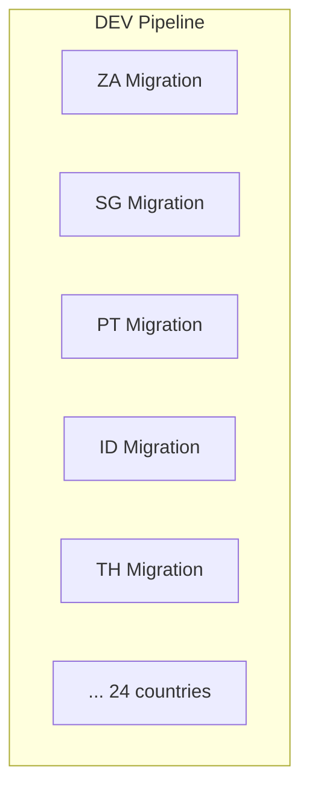
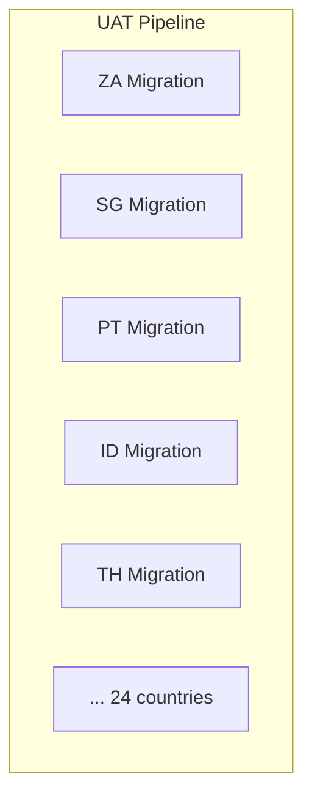
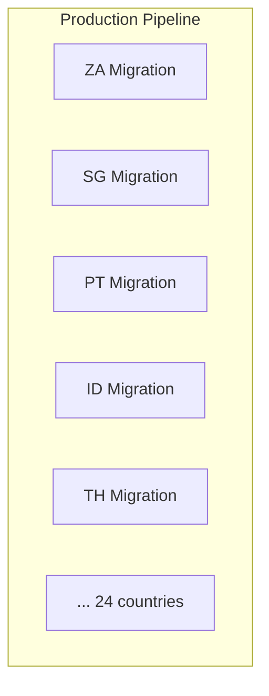

# Grate
## I. Why
| Feature                    | Description |
| -------------------------- | ----------- |
| Database Schema Versioning | Tracks and applies changes to the database schema in sequence            |
| Multiple Database Support  | Works with databases like SQL Server, PostgreSQL, MySQL, and more            |
| Idempotent Scripts         | Allows applying scripts multiple times safely, ensuring no adverse effects            |
| Repeatable Migrations      | Supports both versioned migrations (run once) and repeatable migrations (run every time)            |
| Custom Ordering            | Applies migrations based on naming conventions or specified order            |

## II. Core concepts
- Script Types (https://erikbra.github.io/grate/script-types)
- Directories (https://erikbra.github.io/grate/folder-configuration)
- Environments (https://erikbra.github.io/grate/environment-scripts)

## III. How to install/use
- Grate .NET tool (.NET Core Runtime required)
- Grate Docker (Docker required)

## IV. Proposed structure for tenant/subtenant
> All scripts inside grate `default` directories will be proceed by grate except the `custom` directory (need to run another command with a specified directory, ex: ID, TH,...)

```sh
- Migrations
  - Functions         (default - contains scripts for tenant, all subtenants)
  - Indexes           (default - contains scripts for tenant, all subtenants)
  - RunFirstAfterUp   (default - contains scripts for tenant, all subtenants)
  - Sprocs            (default - contains scripts for tenant, all subtenants)
  - Views             (default - contains scripts for tenant, all subtenants)
  - Up                (default - contains scripts for tenant, all subtenants)
  - Tenants           (custom  - contains scripts for the specific subtenant database or overridden scripts, ex: ID/TH)
    - ID
      - Functions
      - Indexes
      - Views
      - ...
    - TH
      - Functions
      - Indexes
      - Views
      - ...
```

## V. Proposed git strategy
- `Hybrid`: If we're working on micro-services, then each service's repository could have its own database migration structure, placed in the same repository with the source code

```sh
# Single repository
- Migrations
  - Functions
  - Index
  - ...
- src
  - Core.Api
  - Core.Application
  - Core.Persistence
  - Core.Domain
```

- `Standalone`: With this approach, now we could use same strategy as other code repositories, `release` branch should be blocked, developers just allow to make pull requests (with meaningful commits including the ticket numbers)

```sh
# Script repository
- Migrations
  - Functions
  - Index
  - ...
```

```sh
# Code repository
- src
  - Core.Api
  - Core.Application
  - Core.Persistence
  - Core.Domain
```

## VI. How to automate
### 1. Setup CD migration pipeline (for each environment)






### 2. Setup commands (the CD agent with grate tool & .NET Runtime installed)
- When any country migration button pressed on the CD Migration pipeline, the following steps will performed automatically
- `<user>, <password>, <subtenant_host>, <database_name>, <database_type>` could be replaced based on selected country & environment

```sh
# 1. Run tenant scripts
grate \
  --connectionstring="User ID=<user>;Password=<password>;Host=<subtenant_host>;Port=5432;Database=<database_name>;Pooling=true" \
  --sqlfilesdirectory=Migrations \
  --databasetype=<database_type>

# 2. Run subtenant scripts
grate \
  --connectionstring="User ID=<user>;Password=<password>;Host=<subtenant_host>;Port=5432;Database=<database_name>;Pooling=true" \
  --sqlfilesdirectory=Migrations/Tenants/<subtenant_directory> \
  --databasetype=<database_type>
```

## VII. Try Grate locally
### 1. Command
```sh
# 1. Setup mock database
docker compose up -d

# 2. Run the migration manually (try to play with the scripts by adding new files or changing its logic, then run the migration again)
grate \                                                              
  --connectionstring="User ID=postgres;Password=Pass123!;Host=localhost;Port=5432;Database=core;Pooling=true" \
  --sqlfilesdirectory=sql \
  --databasetype=PostgreSQL
```

### 2. Demo
<a href="./demo/migration-tool-demo.mp4" download>Download the demo</a>

<video controls>
  <source src="./demo/migration-tool-demo.mp4" type="video/mp4">
</video>