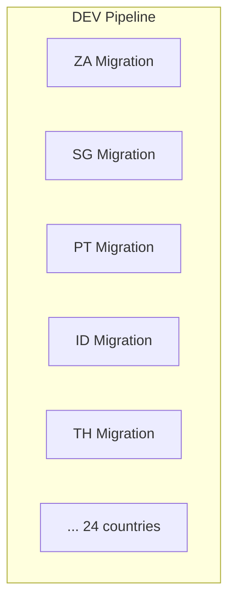
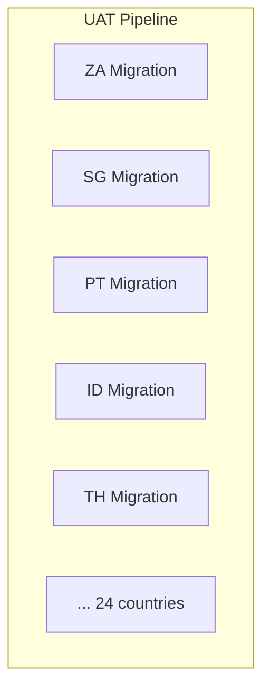
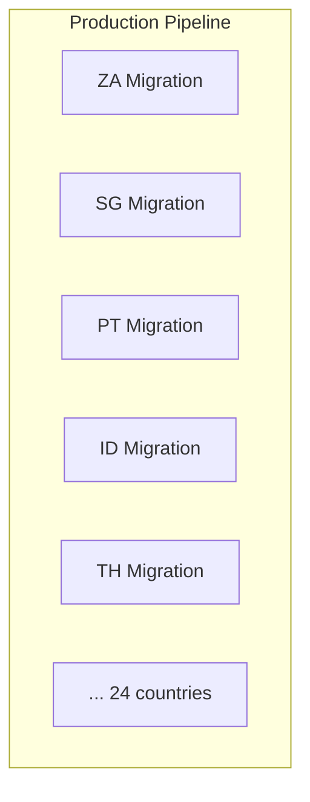

# Grate
## I. Why
- `Database Schema Versioning`: Tracks and applies changes to the database schema in sequence
- `Multiple Database Support`: Works with databases like SQL Server, PostgreSQL, MySQL, and more
- `Idempotent Scripts`: Allows applying scripts multiple times safely, ensuring no adverse effects
- `Repeatable Migrations`: Supports both versioned migrations (run once) and repeatable migrations (run every time)
- `Custom Ordering`: Applies migrations based on naming conventions or specified order

## II. Core Concepts
- Script Types (https://erikbra.github.io/grate/script-types)
- Directories (https://erikbra.github.io/grate/folder-configuration)
- Environments (https://erikbra.github.io/grate/environment-scripts)

## III. Proposed Structure for tenant/subtenant
> All scripts inside grate default directories will be proceed by grate except the custom directory (need to run another command with a specified directory, ex: ID, TH,...)

- Migrations
  - Functions         (`default` - contains scripts for tenant, all subtenants)
  - Indexes           (`default` - contains scripts for tenant, all subtenants)
  - RunFirstAfterUp   (`default` - contains scripts for tenant, all subtenants)
  - Sprocs            (`default` - contains scripts for tenant, all subtenants)
  - Views             (`default` - contains scripts for tenant, all subtenants)
  - Up                (`default` - contains scripts for tenant, all subtenants)
  - Tenants           (`custom` - contains scripts for the specific subtenant database, ex: ID/TH)
    - ID
      - Functions
      - Indexes
      - Views
      - ...
    - TH
      - Functions
      - Indexes
      - Views
      - ...

## IV. Git strategy
- With this approach, now we could use same strategy as code repository, `release` branch should be blocked, developers just allow to make pull requests (with meaningful commits including the ticket number)

## V. How to automate
### 1. Setup CD Migration Pipeline (for each environment)






### 2. Setup Commands (the CD agent with grate tool & .NET Runtime installed)
```sh
# There are 2 steps to run the migration
- When any country migration button pressed on the CD Migration pipeline, the following steps will performed automatically
- <user>, <password>, <subtenant_host>, <database_name>, <database_type> could be replaced based on the environment

## 1. Run tenant scripts
grate \
  --connectionstring="User ID=<user>;Password=<password>;Host=<subtenant_host>;Port=5432;Database=<database_name>;Pooling=true" \
  --sqlfilesdirectory=Migrations \
  --databasetype=<database_type>

## 2. Run subtenant scripts
grate \
  --connectionstring="User ID=<user>;Password=<password>;Host=<subtenant_host>;Port=5432;Database=<database_name>;Pooling=true" \
  --sqlfilesdirectory=Migrations/Tenants/<subtenant_directory> \
  --databasetype=<database_type>
```

## VI. Demo
- [Download the demo](./demo/migration-tool-demo.mkv)